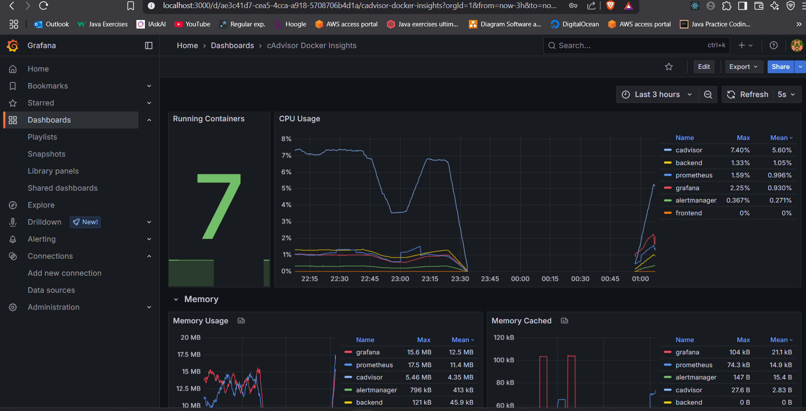

# Containerized Monitored App

This is a final project for the KIU DevOps course.

## Setup Instructions

1. Clone the repository
2. Start the docker daemon
3. Run the following command to build and start the containers: `docker compose -f compose.yaml up -d --build`

## What's included

- A simple web app that listens on port 3001
- A backend that listens for echo requests
- A cAdvisor app exporting container metrics
- A Prometheus server that scrapes the app's metrics
- An Alertmanager server that sends notifications when the app goes down
- A Grafana server that provides a dashboard for the app's metrics

## Notes

- The `Dockerfile` files is used to define and start the containers
- The `compose.yaml` file is used to define the services and their configuration
- The `prometheus.yml` file is used to configure the Prometheus server
- The `alertmanager.yml` file is used to configure the Alertmanager server
- The `dashboards.yaml && datasources.yaml` files are used to configure the Grafana server

